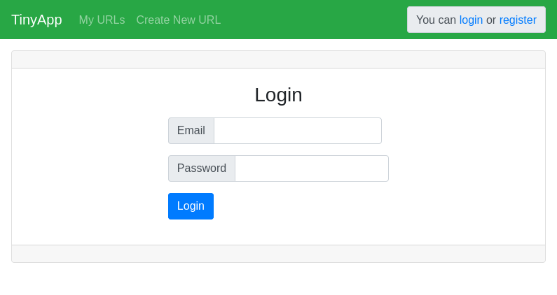

# TinyApp

TinyApp is a full stack web application built with [Node.js](https://nodejs.org) and [Express](https://expressjs.com) that allows users to manage shortened long URLs (much like bit.ly).  Users can log in to an existing account, or create a new one.  Basic URL visitor statistics are kept and can be viewed, including total visits, and a list of unique visits (tracked by session cookie) which includes the number of visits and the timestamp of the last visit.

TinyApp is not suitable for production use and is release to the public domain for demonstration and educational purposes.

## Screenshots

TinyApp is beautiful:




## Getting Started

Install Node.js from your [package manager](https://nodejs.org/en/download/package-manager/), or [download](https://nodejs.org/en/download/) binaries or source code.

Then clone, setup, and run TinyApp:

```
$ git clone https://github.com/d0ugr/tinyapp
$ cd tinyapp
$ npm install
$ npm start [PORT] [USERDB] [URLDB]
```

The port that TinyApp listens on can be given as the first command line argument.  It otherwise defaults to [port 8080](http://localhost:8080).

Sample user and URL data can be loading from JSON files.  The user data file must be the second command line argument, and the URL data file must be the third.

## Development Notes

The source code is arranged as follows:

```
./                 Main project directory including JS files
./views            EJS page templates
./views/partials   Partial HTML templates used by views
./data             Sample data files
./test             Unit tests
./docs             Screenshots
```

## Dependencies

- Node.js
- Express
- EJS
- method-override
- body-parser
- cookie-session
- bcrypt
- fs

## Development Dependencies

- Mocha
- Chai
- Nodemon

## Testing

Unit tests can be run with `npm test`.  See the `test` directory for test scripts.
